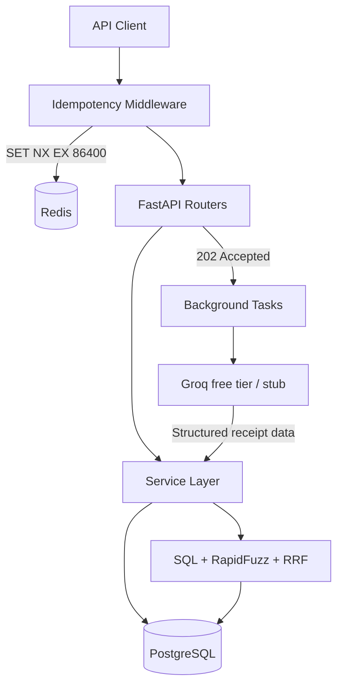

# ReckonFlow

Headless FastAPI backend for corporate travel approvals, an immutable
double-entry ledger, structured receipt extraction, and hybrid bank
reconciliation.

**Live demo:** [https://reckon-flow.onrender.com/docs](https://reckon-flow.onrender.com/docs)

**Docs site (GitHub Pages):** enable Pages → Source **GitHub Actions**, then
open `https://ikrame-ih.github.io/reckon-flow/` after the Docs workflow runs.

> Free Render instances sleep when idle — the first request can take ~50s.

## Why this project

Admin teams often juggle three disconnected flows:

1. Travel pre-requests waiting for approval
2. Bookings made outside the approval system
3. Manual reconciliation of bank CSVs against receipts

ReckonFlow unifies those flows behind an API so finance reviews exceptions
instead of matching every line by hand.

## Architecture



## Stack

| Layer | Choice |
| --- | --- |
| API | Python 3.12 + FastAPI |
| DB | PostgreSQL (SQLite in unit tests) |
| Cache | Redis / Upstash (`Idempotency-Key`) |
| ORM | SQLAlchemy 2 async + Alembic |
| Extraction | Groq when `GROQ_API_KEY` is set; stub otherwise |
| Matching | Date/amount prefilter + RapidFuzz + RRF (k=60) |
| Docs | MkDocs Material → GitHub Pages |
| Tooling | uv, Ruff, mypy, pytest, GitHub Actions |

## Quick start

```bash
uv sync
cp .env.example .env
uv run alembic upgrade head
uv run python scripts/seed_demo.py
uv run uvicorn reckonflow.main:app --reload --port 8000
```

Local docs: http://localhost:8000/docs

## Deploy

| Piece | Host |
| --- | --- |
| API | [Render](https://reckon-flow.onrender.com/docs) |
| Database | Neon |
| Idempotency | Upstash Redis (shared DB OK with `REDIS_KEY_PREFIX=reckonflow:`) |

Migrations run on boot via `scripts/render_start.sh`. Seed Neon from your
laptop when the free Render plan has no shell:

```bash
$env:DATABASE_URL = "<Neon URI>"
uv run python scripts/seed_demo.py
```

## Quality checks

```bash
uv run ruff check src tests
uv run ruff format --check src tests
uv run mypy src
uv run pytest
uv run python scripts/run_evals.py
```

## Build plan

| Phase | Focus | Status |
| --- | --- | --- |
| 0 | Skeleton, `/health`, tooling, CI | Done |
| 1 | Double-entry ledger | Done |
| 2 | Travel + approvals + bank CSV | Done |
| 3 | Redis idempotency | Done |
| 4 | Receipt extraction + evals | Done |
| 5 | Hybrid reconciliation + `FOR UPDATE` | Done |
| 6 | OpenAPI, seed, deploy, docs site | Done |

Walkthrough: see the MkDocs **Build phases** section once Pages is live, or
browse `docs/phases/` in this repo.

## Decisions

- [001 Why not dbt](docs/adr/001-why-not-dbt.md)
- [002 Receipt content is untrusted](docs/adr/002-receipt-untrusted-input.md)
- [003 Redis idempotency](docs/adr/003-redis-idempotency.md)

## Contributing

See [CONTRIBUTING.md](CONTRIBUTING.md) and [SECURITY.md](SECURITY.md).
