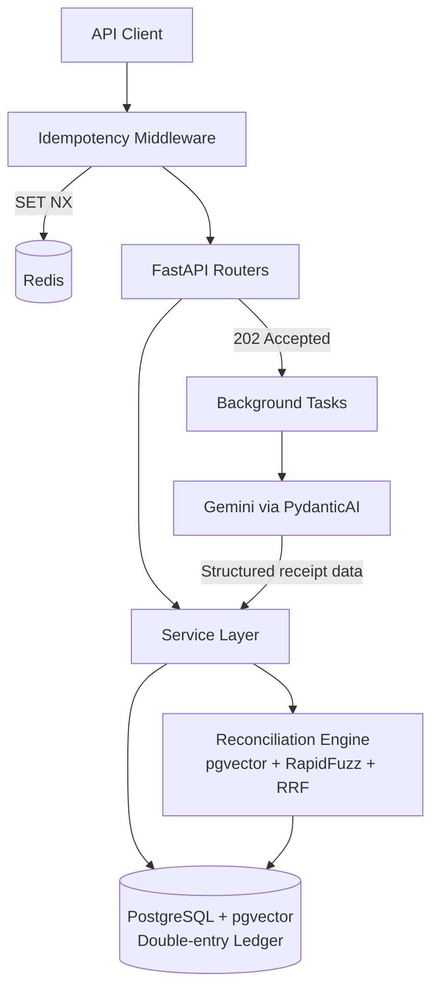

# ReckonFlow

Headless FastAPI backend for corporate travel approvals, an immutable
double-entry ledger, AI receipt extraction, and hybrid bank reconciliation.

> **Current status: Phase 0 complete**
> The API boots, exposes `/health`, and ships with uv, Ruff, mypy, pytest,
> Docker Compose, GitHub Actions, and the first ADR. Ledger work starts in Phase 1.

## Why this project

Admin teams often juggle three disconnected flows:

1. Travel pre-requests waiting for approval
2. Bookings made outside the approval system
3. Manual reconciliation of bank CSVs against receipts

ReckonFlow unifies those flows behind an API so finance reviews exceptions
instead of matching every line by hand.

## Architecture (target)



Phase 0 only wires the API process and `/health`. Redis, the ledger,
LLM extraction, and reconciliation land in later phases.

## Stack (target)

| Layer | Choice |
| --- | --- |
| API | Python 3.12 + FastAPI |
| DB | PostgreSQL + pgvector |
| Cache | Redis (idempotency) |
| ORM | SQLAlchemy 2 async (from Phase 1) |
| AI | Gemini via structured outputs (Phase 4) |
| Tooling | uv, Ruff, mypy, pytest, pre-commit, Docker Compose, GitHub Actions |

## Phase 0 layout

```text
reckonflow/
├── src/reckonflow/
│   ├── api/v1/          # HTTP routes (health only for now)
│   ├── core/            # settings + logging
│   ├── schemas/         # Pydantic response models
│   ├── models/          # (Phase 1) SQLAlchemy tables
│   ├── services/        # (Phase 1) business logic
│   ├── ai/              # (Phase 4) LLM extraction
│   └── tasks/           # (Phase 4) background jobs
├── tests/
├── docs/adr/            # Architecture Decision Records
├── docker-compose.yml   # Postgres + Redis for later phases
├── pyproject.toml
└── .github/workflows/ci.yml
```

## Quick start

```bash
# 1. Install dependencies
uv sync

# 2. Copy env defaults
copy .env.example .env   # Windows
# cp .env.example .env   # macOS / Linux

# 3. Optional: install git hooks
uv run pre-commit install

# 4. Run the API
uv run uvicorn reckonflow.main:app --reload --port 8000

# 5. Check health
curl http://localhost:8000/health
```

Interactive docs: [http://localhost:8000/docs](http://localhost:8000/docs)

## Quality checks

```bash
uv run ruff check src tests
uv run mypy src
uv run pytest
uv run pre-commit run --all-files
```

## Build plan

| Phase | Focus | Status |
| --- | --- | --- |
| 0 | Skeleton, `/health`, tooling, CI | Done |
| 1 | Double-entry ledger | Next |
| 2 | Travel requests + approvals + bank CSV | Planned |
| 3 | Redis idempotency | Planned |
| 4 | AI receipt extraction + evals | Planned |
| 5 | Hybrid reconciliation (pgvector + RapidFuzz + RRF) | Planned |
| 6 | Portfolio polish + demo seed | Planned |

## Decision notes

Architecture Decision Records live in [`docs/adr/`](docs/adr/).

- [ADR 001: Why not dbt](docs/adr/001-why-not-dbt.md) — ReckonFlow is OLTP;
  dbt stays a future option for reporting (OLAP).
