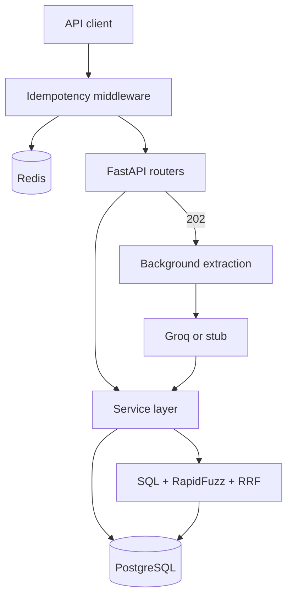

# ReckonFlow

ReckonFlow is a **headless** FastAPI backend for corporate travel:

- pre-approvals for trips
- an immutable **double-entry ledger**
- structured **receipt extraction**
- hybrid **bank reconciliation**

There is no product UI. The interactive demo is Swagger:

**[Live API docs](https://reckon-flow.onrender.com/docs)**

## Contents

- [Getting started](getting-started.md)
- [Build phases](phases/index.md)
- [Glossary](glossary.md)
- [Security notes](security.md)
